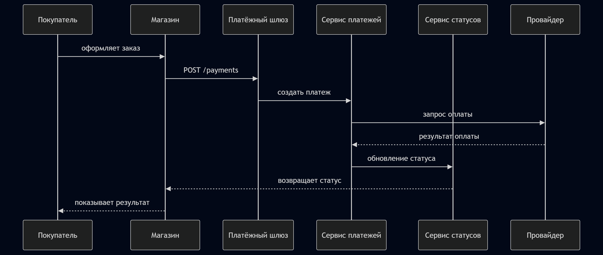
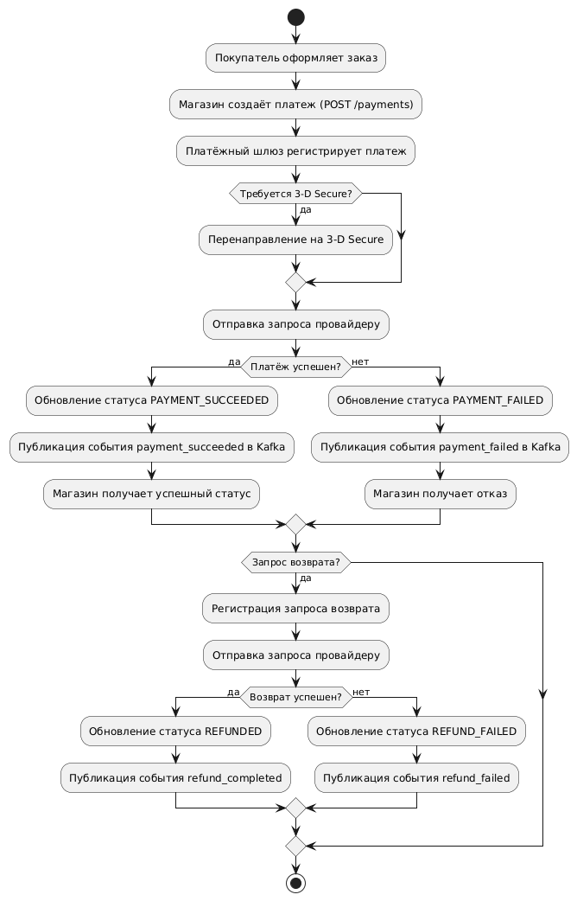

# Payment Gateway (Pet Project)

Пет-проект внутреннего платёжного шлюза для группы интернет-магазинов.

Сервис предоставляет единый REST API для обработки онлайн-платежей банковскими картами через внешний платёжный провайдер (банк-эквайер). Проект демонстрирует подход к проектированию backend-системы: требования, архитектуру, API-контракты и событийную модель.

## Цель проекта

Показать пример проектирования платёжного сервиса с точки зрения системного анализа:

* формализация требований
* описание архитектуры
* проектирование REST API
* проектирование событийной модели (Kafka)
* демонстрация типовых бизнес-процессов оплаты

Проект является **pet-проектом и не предназначен для использования в production**.

---

# Основные возможности (MVP)

Сервис поддерживает базовые платёжные операции:

* создание платежа
* получение статуса платежа
* возврат средств (полный или частичный)
* получение списка платежей по заказу или клиенту
* публикация событий о платежах в Kafka

---

# Архитектура (упрощённо)

```text
Merchant System (интернет-магазин)
        │
        ▼
Payment Gateway API
        │
        ├── Payment Service
        ├── Refund Service
        ├── Payment Status Service
        │
        ▼
External Payment Provider (Acquirer)

Дополнительно:
Kafka — публикация событий платежей
Database — хранение информации о транзакциях
```

---


## Поток платежа (упрощённая диаграмма)

---


---

### Пояснения к диаграмме

1. **POST /payments** — магазин инициирует платеж.
2. **Acquirer** — внешний платёжный провайдер (банк), который обрабатывает оплату.
3. **Payment Status Service** — проверяет и обновляет статус платежа.
4. **Refund Service** — при необходимости обрабатывает возврат (полный или частичный).
5. **Kafka** — публикуются события для аналитики и будущих сервисов (payment_created, payment_succeeded и т.д.).
   
---

---


## BPMN / Activity Diagram: поток оплаты и возврата (MVP)




---

# Бизнес-сценарии

Основные сценарии системы:

1. **Успешная оплата заказа**
2. **Неуспешная оплата**
3. **Просмотр статуса платежа**
4. **Запрос возврата средств**
5. **Получение истории платежей**

Подробное описание сценариев приведено в документации.

---

# Структура проекта

```text
payment-gateway-pet-project
│
├── README.md
├── docker-compose.yml
├── .env.example
│
├── docs
│   ├── requirements.md
│   ├── architecture.md
│   ├── api-contract.md
│   └── events.md
│
├── api
│   └── openapi.yaml
│
├── kafka
│   ├── topics-config
│   └── examples
│
├── mock-gateway
│
├── samples
│   ├── requests
│   └── use-cases.md
│
└── tests
```

---

# Документация

Основные документы проекта:

* **Требования** — `docs/requirements.md`
* **Архитектура системы** — `docs/architecture.md`
* **Контракт REST API** — `docs/api-contract.md`
* **События Kafka** — `docs/events.md`

---

## Быстрый старт: поднять Prism + Kafka + mock-gateway

Ниже приведён минимальный сценарий, который позволяет «с нуля» поднять инфраструктуру, прогнать демо-поток платежа/возврата и увидеть события в Kafka UI.

### 1. Предварительные требования

- **Docker** и **Docker Compose** установлены локально.
- Порт `4010` свободен (Prism), порт `8080` свободен (Kafka UI), порт `29092` свободен (внешний доступ к Kafka).

### 2. Клонировать репозиторий

```bash
git clone <url-репозитория>
cd Payment-Gateway
```

### 3. Запустить docker-compose

В корне проекта есть файл `docker-compose.yml`, который поднимает сразу несколько сервисов:

- `prism` — mock REST API по спецификации `api/openapi.yaml`;
- `zookeeper` + `kafka` — брокер Kafka для событий;
- `kafka-ui` — web-интерфейс для просмотра топиков и сообщений;
- `mock-gateway` — небольшой сервис, который ходит в Prism и публикует события в Kafka.

Запуск:

```bash
docker compose up -d
```

Проверить, что все контейнеры поднялись:

```bash
docker compose ps
```

Ожидаемые сервисы:

- `payment-gateway-prism` (порт `4010`);
- `payment-gateway-zookeeper`;
- `payment-gateway-kafka` (порт `29092`);
- `payment-gateway-kafka-ui` (порт `8080`);
- `payment-gateway-mock-gateway`.

### 4. Проверить Prism (mock REST API)

Prism поднимается на `http://localhost:4010` и мокает спецификацию `api/openapi.yaml`.

Примеры:

- Создать платёж:

```bash
curl -X POST "http://localhost:4010/payments" ^
  -H "Content-Type: application/json" ^
  -d "{\"orderId\":\"ORD-100500\",\"amount\":149.9,\"currency\":\"EUR\",\"cardToken\":\"tok_demo_123\"}"
```

- Получить статус платежа:

```bash
curl "http://localhost:4010/payments/pay_demo_1"
```

(конкретные значения `paymentId` зависят от поведения Prism/mock-а.)

### 5. Что делает mock-gateway

Сервис `mock-gateway` автоматически запускается вместе с `docker-compose` и выполняет демо-поток:

1. Делает `POST /payments` к Prism, создавая тестовый платёж.
2. Публикует в Kafka последовательность событий:
   - `payment_created`
   - `payment_succeeded`
3. Делает `POST /payments/{paymentId}/refunds` к Prism (демо-запрос возврата).
4. Публикует события:
   - `refund_requested`
   - `refund_completed`

Логи можно посмотреть командой:

```bash
docker logs -f payment-gateway-mock-gateway
```

### 6. Смотреть события в Kafka UI

Kafka UI доступен по адресу:

```text
http://localhost:8080
```

Дальше:

1. Открыть кластер `local`.
2. Перейти в раздел **Topics**.
3. Найти и открыть топики:
   - `payments.lifecycle` — события о жизенном цикле платежей (`payment_created`, `payment_succeeded`, `payment_failed`).
   - `payments.refunds` — события о возвратах (`refund_requested`, `refund_completed`).
4. В разделе **Messages** увидеть опубликованные mock-gateway JSON-сообщения (структура совпадает с описанной в `docs/events.md` и примерами из `kafka/examples`).

При перезапуске `mock-gateway` (например, через `docker restart payment-gateway-mock-gateway`) демо-поток можно повторять, порождая новые события.

### 7. Остановка окружения

Чтобы остановить и удалить контейнеры:

```bash
docker compose down
```

---

# REST API

Спецификация API представлена в формате OpenAPI:

```
api/openapi.yaml
```

Основные endpoints:

| Метод | Endpoint              | Описание                  |
| ----- | --------------------- | ------------------------- |
| POST  | /payments             | создание платежа          |
| GET   | /payments/{paymentId} | получение статуса платежа |
| POST  | /refunds              | создание возврата         |
| GET   | /payments             | список платежей           |

---

# Kafka события

Сервис публикует события при изменении состояния платежей:

* `payment_created`
* `payment_succeeded`
* `payment_failed`
* `refund_requested`
* `refund_completed`

Примеры сообщений находятся в:

```
kafka/examples
```

---

# Примеры использования API

Примеры запросов и сценариев:

```
samples/requests
samples/use-cases.md
```

---

# Mock-сервис

В проекте предусмотрен простой mock-сервис, имитирующий работу платёжного шлюза.

Он реализует основные endpoints и может использоваться для демонстрации сценариев API.

Каталог:

```
mock-gateway
```

---

# Ограничения MVP

Для упрощения реализации приняты следующие ограничения:

* поддерживается **один платёжный провайдер**
* поддерживаются **только платежи банковскими картами**
* используется **одна валюта — EUR**
* система **не хранит данные банковских карт**
* интеграция с провайдером реализуется через **redirect или токены**

---

# Возможные направления развития

В дальнейшем система может быть расширена:

* поддержка нескольких платёжных провайдеров
* маршрутизация платежей
* антифрод-модуль
* real-time аналитика
* подписки и рекуррентные платежи
* мультивалютность
* webhook-уведомления для магазинов

---

# Назначение проекта

Проект создан в образовательных целях для демонстрации навыков:

* системного анализа
* проектирования API
* описания архитектуры backend-сервисов
* работы с event-driven архитектурой

